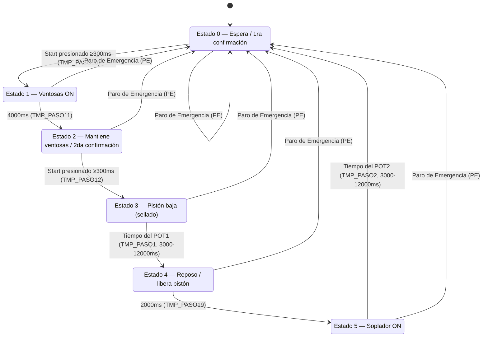
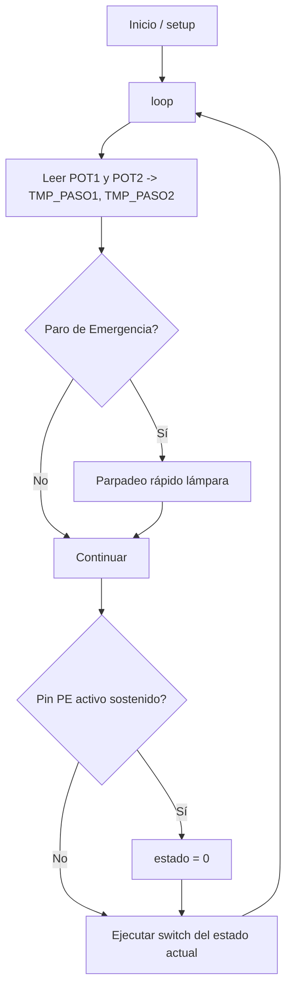

# Selladora 31 — Documentación Técnica

> Sistema de control embebido para una **máquina selladora industrial**, implementado sobre un microcontrolador **ESP32** con Arduino Framework. El sistema controla un ciclo automático de sellado térmico mediante ventosas de sujeción, un pistón de sellado y un soplador de enfriamiento/expulsión, todo coordinado por una **máquina de estados finita (FSM)** no bloqueante basada en `millis()`.

---

## 1. Resumen del proyecto

| Campo | Detalle |
|---|---|
| Plataforma | ESP32 (Arduino Core) |
| Lenguaje | C++ (Arduino `.ino`) |
| Paradigma de control | Máquina de estados finita (FSM) no bloqueante |
| Archivos | `Selladora31_Codigo_Bueno_copy_20250415185654.ino`, `Variables.h`, `Funcion_Parpadeo.ino` |
| Entradas físicas | Botón de inicio (Start), Paro de Emergencia (PE), 2 potenciómetros |
| Salidas físicas | Lámpara piloto verde, Soplador, Pistón, Ventosas |

### Propósito

El equipo automatiza el ciclo de una selladora: el operario coloca el producto, presiona el botón de inicio dos veces (doble confirmación de seguridad) y la máquina ejecuta de forma autónoma:

1. Sujeción del empaque con ventosas.
2. Descenso del pistón de sellado térmico (tiempo regulable por potenciómetro).
3. Liberación y reposo breve.
4. Soplado de enfriamiento/expulsión (tiempo regulable por otro potenciómetro).
5. Regreso al estado de espera.

---

## 2. Arquitectura de archivos

```
Selladora31_Codigo_Bueno_copy_20250415185654/
├── Selladora31_Codigo_Bueno_copy_20250415185654.ino   # setup() + loop() + FSM principal
├── Variables.h                                         # Definición de pines, banderas y temporizadores
└── Funcion_Parpadeo.ino                                # Función auxiliar de parpadeo no bloqueante
```

- **`Variables.h`**: centraliza la configuración de hardware (pines) y el estado global del sistema (banderas, temporizadores). Se incluye con `#include "Variables.h"` al inicio del `.ino` principal.
- **`Funcion_Parpadeo.ino`**: el IDE de Arduino compila todos los `.ino` de la carpeta como una sola unidad, por lo que `parpadearLamparaVerde()` queda disponible globalmente sin necesidad de declaración previa.
- **`Selladora31_Codigo_Bueno_copy_20250415185654.ino`**: contiene `setup()` (inicialización de pines) y `loop()` (lectura de potenciómetros, lógica de seguridad y la FSM de 6 estados).

---

## 3. Mapa de hardware (pines ESP32)

| Constante | Pin ESP32 | Tipo | Función |
|---|---|---|---|
| `LamparaVerde` | 12 | OUTPUT | Lámpara piloto verde (indica estado de espera / alarma mediante parpadeo) |
| `A` | 27 | OUTPUT | **Soplador** (enfriamiento / expulsión) |
| `B` | 33 | OUTPUT | **Pistón** de sellado |
| `C` | 32 | OUTPUT | **Ventosas** de sujeción |
| `StartButton` | 5 | INPUT_PULLDOWN | Botón de inicio de ciclo |
| `PE` | 18 | INPUT_PULLDOWN | Botón / sensor de Paro de Emergencia |
| `pinPotenciometro` | 34 (ADC) | INPUT analógico | Ajusta el tiempo de **sellado** (`TMP_PASO1`) |
| `pin2Potenciometro` | 35 (ADC) | INPUT analógico | Ajusta el tiempo de **soplado** (`TMP_PASO2`) |

> Nota: al usar `INPUT_PULLDOWN`, las entradas digitales están en `LOW` en reposo y pasan a `HIGH` cuando se presionan/activan (lógica activa en alto).

---

## 4. Variables clave (`Variables.h`)

### Banderas de control
- `Arranque`, `Arranque2`: confirman, respectivamente, la primera y segunda pulsación del botón de inicio (doble confirmación de seguridad antes de activar partes móviles).
- `confirmacion1`, `confirmacion2`, `confirmacion3`: banderas intermedias que habilitan el avance de estado una vez transcurrido el tiempo mínimo de confirmación.
- `ParoEmergencia`: bandera de paro de emergencia (ver [Sección 7 — Hallazgos técnicos](#7-hallazgos-técnicos-y-notas-de-mantenimiento)).
- `estado`: variable entera que determina el caso activo del `switch` (0 a 5).

### Temporizadores (no bloqueantes, basados en `millis()`)
- `TMP_ANTERIOR`: marca de tiempo de referencia para medir la duración de cada estado.
- `previousPress`, `previousPressPE`: marcas de tiempo usadas en el antirrebote (debounce) del botón de inicio y del paro de emergencia.
- `previousMillis1`, `previousMillis2`: usadas por la función de parpadeo de la lámpara.

### Tiempos de paso (ms)
| Variable | Valor | Uso |
|---|---|---|
| `TMP_PASO10` | 300 | Confirmación mínima de pulsación de Start en estado 0 |
| `TMP_PASO11` | 4000 | Duración de activación de ventosas (estado 1) |
| `TMP_PASO12` | 300 | Confirmación mínima de la segunda pulsación de Start en estado 2 |
| `TMP_PASO1` | dinámico (3000–12000) | Tiempo de **sellado** (pistón abajo), controlado por `pinPotenciometro` |
| `TMP_PASO19` | 2000 | Tiempo de reposo tras liberar el pistón (estado 4) |
| `TMP_PASO2` | dinámico (3000–12000) | Tiempo de **soplado**, controlado por `pin2Potenciometro` |

---

## 5. Lógica de funcionamiento — Máquina de Estados (FSM)

El `loop()` ejecuta en cada iteración:

1. **Lectura de potenciómetros**: convierte la lectura ADC (0–4095) en un rango de tiempo de 3000 a 12000 ms mediante `map()`, para `TMP_PASO1` (sellado) y `TMP_PASO2` (soplado).
2. **Chequeo de Paro de Emergencia** (lectura directa del pin `PE` con antirrebote de 50 ms): si se detecta la pulsación sostenida, fuerza `estado = 0`.
3. **Switch/case** con 6 estados que controla las salidas físicas.

### Diagrama de estados



### Detalle de cada estado

| Estado | Salidas activas (A=Soplador, B=Pistón, C=Ventosas) | Condición de salida | Descripción funcional |
|---|---|---|---|
| **0** | A=0, B=0, C=0 | Start presionado y sostenido ≥ `TMP_PASO10` (300 ms) | Reposo. Si no hay pulsación, la lámpara verde parpadea cada 1400 ms como señal de espera. |
| **1** | C=1 (ventosas) | `TMP_PASO11` (4000 ms) cumplidos | Se activan las ventosas para sujetar el empaque. |
| **2** | C=1 (mantiene ventosas) | 2da pulsación de Start sostenida ≥ `TMP_PASO12` (300 ms) | Espera la segunda confirmación de seguridad del operario antes de bajar el pistón. |
| **3** | B=1 (pistón), C=0 | Tiempo `TMP_PASO1` (regulado por POT1) cumplido | El pistón desciende y realiza el sellado térmico. Duración ajustable por el operario. |
| **4** | B=0, C=1 | `TMP_PASO19` (2000 ms) cumplidos | Se libera el pistón; pausa de estabilización antes del soplado. |
| **5** | A=1 (soplador) | Tiempo `TMP_PASO2` (regulado por POT2) cumplido | Se enfría/expulsa el producto. Al finalizar, regresa al estado 0 y reinicia las banderas de confirmación. |

### Mecanismo de doble confirmación (seguridad)

El ciclo exige **dos pulsaciones independientes** del botón de inicio:
- La primera (estado 0 → 1) habilita la sujeción por ventosas.
- La segunda (estado 2 → 3) habilita el descenso del pistón (parte de mayor riesgo mecánico).

Ambas pulsaciones requieren mantenerse presionadas un mínimo de tiempo (antirrebote por tiempo sostenido) antes de considerarse válidas, evitando activaciones accidentales por ruido eléctrico o pulsaciones involuntarias.

### Función de parpadeo (`Funcion_Parpadeo.ino`)

```cpp
void parpadearLamparaVerde(long intervalo, unsigned long &previousMillis)
```

Implementa un parpadeo no bloqueante (patrón estándar "Blink Without Delay"): compara `millis()` contra una marca de tiempo pasada por referencia y alterna el estado de `LamparaVerde` cada vez que transcurre `intervalo`. Se usa tanto para señalizar espera de inicio (1400 ms) como paro de emergencia (400 ms, parpadeo más rápido = alarma).

---

## 6. Diagrama de flujo general



---

## 7. Hallazgos técnicos y notas de mantenimiento

> Observaciones detectadas durante el análisis del código, útiles para una futura refactorización.

1. **Variable `ParoEmergencia` posiblemente sin efecto real**: se inicializa en `false` y nunca se le asigna otro valor en el código visible. La condición `if (ParoEmergencia == false)` por tanto siempre se cumple en cada vuelta del `loop()`, haciendo parpadear la lámpara verde de forma constante e independiente del estado real del pin `PE`. El paro de emergencia *funcional* en realidad ocurre por la lectura directa de `digitalRead(PE)` más abajo en el código, no por esta variable. Esto sugiere una funcionalidad incompleta o un remanente de una versión anterior del firmware.
2. **Uso intensivo de `Serial.println` en el `loop()`**: útil para depuración, pero en producción incrementa la latencia del ciclo y puede ralentizar la respuesta de la FSM. Se recomienda condicionar estos mensajes con una bandera `DEBUG` o eliminarlos en la versión final.
3. **Bloque de lectura serial comentado**: existe código comentado para simular pulsaciones de botones vía monitor serial (tecla `p` para paro, `s` para inicio), útil en pruebas de banco sin hardware físico conectado.
4. **Nomenclatura de pines genérica (`A`, `B`, `C`)**: aunque están comentados (`Soplador`, `Pistón`, `Ventosas`), nombres descriptivos (`PIN_SOPLADOR`, `PIN_PISTON`, `PIN_VENTOSAS`) mejorarían la legibilidad y evitarían colisiones de nombres.
5. **Configuración de pines previa comentada en `Variables.h`**: se conserva un bloque de pines anterior (líneas 2–10) comentado, correspondiente a una distribución de hardware distinta — probablemente una iteración previa del cableado de la máquina.

---

## 8. Glosario

- **FSM (Finite State Machine)**: técnica de control donde el comportamiento del sistema se modela como un conjunto finito de estados y transiciones, evitando el uso de `delay()` bloqueante.
- **Debounce (antirrebote)**: técnica para filtrar lecturas inestables de un pulsador mecánico, exigiendo que la señal se mantenga estable durante un tiempo mínimo.
- **PE (Paro de Emergencia)**: mecanismo de seguridad que detiene el ciclo automático ante una condición de riesgo.

---

## 9. Posibles mejoras futuras

- Implementar máquina de estados con `enum` en lugar de enteros mágicos, mejorando la legibilidad (`ESTADO_ESPERA`, `ESTADO_VENTOSAS`, etc.).
- Resolver la inconsistencia de la variable `ParoEmergencia` para que refleje realmente el estado del pin `PE`.
- Añadir una bandera global `DEBUG_MODE` para activar/desactivar los `Serial.println`.
- Persistir los tiempos de sellado/soplado en memoria no volátil (`Preferences`/`EEPROM`) si se desea reemplazar los potenciómetros por una interfaz digital en el futuro.

---

*Documento generado a partir del análisis estático del firmware del proyecto Selladora31 (ESP32 / Arduino). Sirve como evidencia técnica de diseño e implementación de sistemas de control embebido con máquinas de estado para portafolio profesional.*
